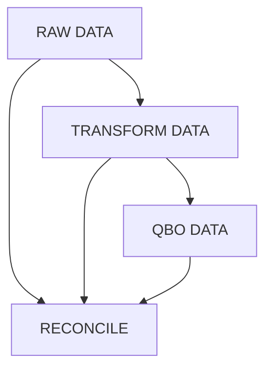
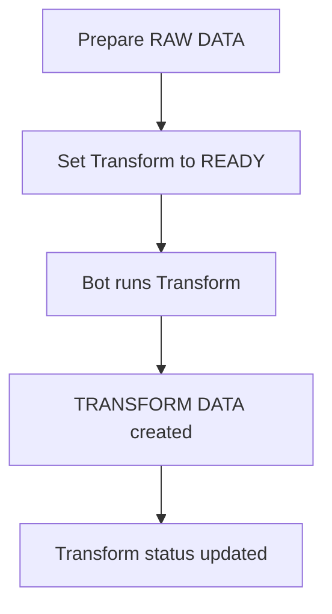
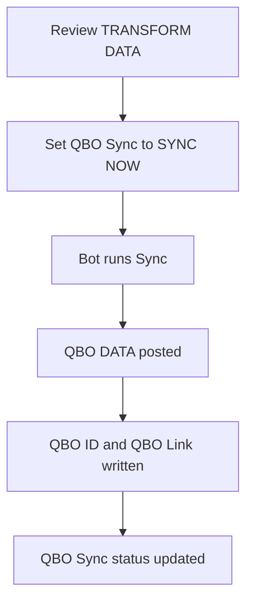
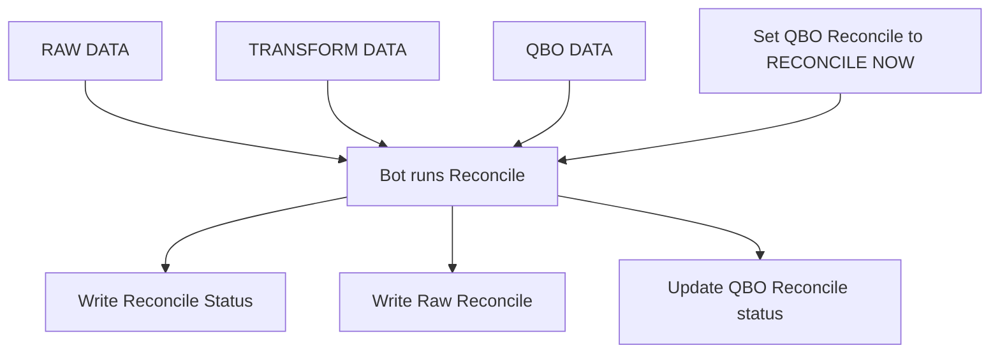

# QBO Automation Bot - User Guide

This guide is for users who operate the `JOBS CONTROL` sheet.
The business flow is:

`RAW DATA` -> `TRANSFORM DATA` -> `QBO DATA`

## End-to-End Flow

## What You Change in Control Sheet

- Set `Transform` to `READY`
- Set `QBO Sync` to `SYNC NOW`
- Set `QBO Reconcile` to `RECONCILE NOW`

Only set these trigger values. The bot writes all processing statuses.

## Step 1: Transform (`RAW DATA` -> `TRANSFORM DATA`)

### What to do

1. In `JOBS CONTROL`, add or select the row for that month.
2. Fill `Country`, `Source File`, `Tab Name`, `Month`.
3. Leave `Transform File` blank if not available yet.
4. Set `Transform` = `READY`.

### What bot updates

- `Transform`: `PROCESSING` -> `DONE` / `DONE (Empty)` / `DONE (No Data)` / `ERROR`
- `Transform File`: create (if missing) and write Journals, Expenses, Transfers tabs
- Per-stream status columns:
  - `QBO Journal`
  - `QBO Expense`
  - `QBO Transfer`
  Values become `READY TO SYNC` or `ERROR` based on `Remarks`

### If Transform = `ERROR` (what to do)

1. Open `Transform File`.
2. Check `Remarks` in all three tabs.
3. Focus first on rows with `ERROR` or `Unbalance`.
4. Fix raw data in `Source File` month tab.
5. In `JOBS CONTROL`, set `Transform` back to `READY`.
6. Wait for bot to rerun.

### Common Transform error causes

- Invalid or unmapped account/class/location/vendor names
- Date values outside the selected `Month`
- Unbalanced journal lines
- Missing mandatory fields in raw rows

If errors are token/auth/realm related, contact Admin.

## Step 2: Sync (`TRANSFORM DATA` -> `QBO DATA`)

### What to do

1. Open `Transform File` and review `Remarks`.
2. Confirm only intended rows are `Ready to sync`.
3. Set `QBO Sync` = `SYNC NOW`.

### What bot updates

- `QBO Sync`: `PROCESSING` -> `DONE` or `PARTIAL ERROR`
- Writes `QBO ID`, `QBO Link`, and updated `Remarks` in transform tabs
- Updates `QBO Journal`, `QBO Expense`, `QBO Transfer` to `SYNCED` or `SYNC FAIL`
- Updates `Last Sync At`

### If QBO Sync = `PARTIAL ERROR` (what to do)

1. Open each transform tab and filter `Remarks` containing `ERROR:`.
2. Separate failures by type:
   - Data/mapping error: fix source data, rerun `Transform = READY`, then rerun `QBO Sync = SYNC NOW`.
   - Temporary API/network issue: retry `QBO Sync = SYNC NOW`.
3. Leave rows marked `Skipper (Already synced in QBO at ...)` as-is. They are already synced.
4. Recheck `QBO ID` and `QBO Link` for rows that succeeded.

### Notes for sync behavior

- Bot syncs only rows where `Remarks` contains `Ready to sync`.
- Duplicate reference numbers in QBO are skipped (not treated as failure).

## Step 3: Reconcile (Compare `TRANSFORM DATA` with `RAW DATA` and `QBO DATA`)

### What to do

1. Set `QBO Reconcile` = `RECONCILE NOW`.

### What bot updates

- `QBO Reconcile`: `RUNNING...` -> `DONE` or `DONE (Issues Found)`
- Writes `Reconcile Status` and `Raw Reconcile` in transform tabs
- Updates `QBO Journal`, `QBO Expense`, `QBO Transfer` to `SYNCED` or `QBO MISMATCH`
- Updates `Last Sync At`

### If QBO Reconcile = `DONE (Issues Found)` (what to do)

1. Open transform tabs and review:
   - `Reconcile Status` (Transform vs QBO)
   - `Raw Reconcile` (Raw vs Transform)
2. Prioritize rows marked `Mismatch` or `Missing`.
3. Decide correction point:
   - Raw data wrong -> fix source, rerun Transform, then Sync, then Reconcile.
   - QBO post-sync edits happened -> resync corrected data and rerun Reconcile.
4. Run `QBO Reconcile = RECONCILE NOW` again after fixes.

### If QBO Reconcile = `ERROR: Missing Info`

- Check row has valid `Transform File` and `Month`.
- Fix missing fields and trigger `QBO Reconcile = RECONCILE NOW` again.

## Error Handling Playbook (Fast)

| Step | Bot status | Meaning | Your action |
|---|---|---|---|
| Transform | `ERROR` | Transform failed at row/job level | Check `Remarks`, fix raw data, set `Transform = READY` |
| Transform | `DONE (No Data)` | Month has no rows after month filter | Validate `Month`, `Date`, and raw tab content |
| Sync | `PARTIAL ERROR` | Some rows synced, some failed | Fix `ERROR:` rows, rerun `SYNC NOW` |
| Reconcile | `DONE (Issues Found)` | Mismatch/missing found | Review `Reconcile Status` + `Raw Reconcile`, fix and rerun |
| Reconcile | `ERROR: Missing Info` | Missing required control values | Fill missing `Transform File`/`Month`, rerun |

## Monthly Checklist

1. Add/verify monthly raw tab in Source File.
2. In `JOBS CONTROL`, prepare one row for the month.
3. Run `Transform = READY`.
4. Resolve Transform errors until clean.
5. Run `QBO Sync = SYNC NOW`.
6. Resolve sync partial errors if any.
7. Run `QBO Reconcile = RECONCILE NOW`.
8. Resolve reconcile issues if found.

## Status Reference

| Column | You set | Bot sets |
|---|---|---|
| `Transform` | `READY` | `PROCESSING`, `DONE`, `DONE (Empty)`, `DONE (No Data)`, `ERROR` |
| `QBO Sync` | `SYNC NOW` | `PROCESSING`, `DONE`, `PARTIAL ERROR` |
| `QBO Reconcile` | `RECONCILE NOW` | `RUNNING...`, `DONE`, `DONE (Issues Found)`, `ERROR: Missing Info` |

For technical setup and admin operations, see `DOCUMENTATION.md`.
